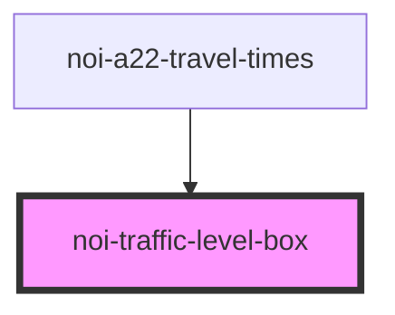

<!--
SPDX-FileCopyrightText: NOI Techpark <digital@noi.bz.it>

SPDX-License-Identifier: CC0-1.0
-->

# noi-traffic-level-box

<!-- Auto Generated Below -->

## Overview

(INTERNAL) part of 'noi-traffic-prediction'

## Properties

| Property | Attribute | Description | Type                                    | Default     |
| -------- | --------- | ----------- | --------------------------------------- | ----------- |
| `level`  | `level`   |             | `-1 \| 1 \| 2 \| 3 \| 4 \| 5 \| string` | `undefined` |

## Dependencies

### Used by

 - [noi-a22-travel-times](../..)

### Graph

----------------------------------------------

*Built with [StencilJS](https://stenciljs.com/)*
