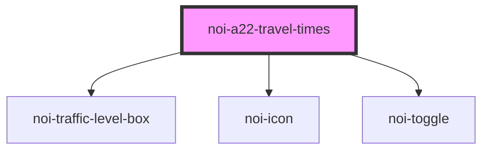

<!--
SPDX-FileCopyrightText: NOI Techpark <digital@noi.bz.it>

SPDX-License-Identifier: CC0-1.0
-->
# noi-a22-travel-times

<!-- Auto Generated Below -->

## Overview

Traffic forecast component

## Properties

| Property         | Attribute         | Description          | Type                                          | Default   |
| ---------------- | ----------------- | -------------------- | --------------------------------------------- | --------- |
| `language`       | `language`        | Language             | `string`                                      | `'en'`    |
| `layout`         | `layout`          | Layout appearance    | `"auto" \| "desktop" \| "mobile" \| "tablet"` | `'auto'`  |
| `reloadInterval` | `reload-interval` | Data reload interval | `number`                                      | `600000`  |
| `vehicleType`    | `vehicle-type`    | Vehicle type         | `"heavy" \| "light"`                          | `'light'` |

## Methods

### `refreshData() => Promise<void>`

Reload traffic data

#### Returns

Type: `Promise<void>`

## Shadow Parts

| Part        | Description |
| ----------- | ----------- |
| `"content"` | Content     |
| `"footer"`  | Footer      |
| `"scroll"`  |             |
| `"title"`   | Title       |

## CSS Custom Properties

| Name                             | Description                        |
| -------------------------------- | ---------------------------------- |
| `--busy-box-size`                | Size of the traffic box indicator  |
| `--color-background`             | Background color                   |
| `--color-border`                 | Border line color                  |
| `--color-busy-critical`          | Critical traffic color             |
| `--color-busy-critical-contrast` | Critical traffic contrast color    |
| `--color-busy-empty`             | No data traffic color              |
| `--color-busy-empty-contrast`    | No data traffic contrast color     |
| `--color-busy-heavy`             | Heavy traffic color                |
| `--color-busy-heavy-contrast`    | Heavy traffic contrast color       |
| `--color-busy-light`             | Light delay traffic color          |
| `--color-busy-light-contrast`    | Light delay traffic contrast color |
| `--color-busy-regular`           | Regular traffic color              |
| `--color-busy-regular-contrast`  | Regular traffic contrast color     |
| `--color-busy-severe`            | Severe traffic color               |
| `--color-busy-severe-contrast`   | Severe traffic contrast color      |
| `--color-car-handle`             | Handle color                       |
| `--color-car-heavy`              | Label color of heavy car option    |
| `--color-car-light`              | Label color of light car option    |
| `--color-footer`                 | Footer color                       |
| `--color-footer-contrast`        | Footer contrast color              |
| `--color-primary`                | Primary color                      |
| `--color-secondary`              | Secondary color                    |
| `--color-text`                   | Text color                         |
| `--scrollbar-bg`                 | Scrollbar background color         |
| `--scrollbar-color`              | Scrollbar thumb color              |

## Dependencies

### Depends on

- [noi-traffic-level-box](./partials/level-box)
- [noi-icon](../blocks/icon)
- [noi-toggle](../blocks/toggle)

### Graph

----------------------------------------------

*Built with [StencilJS](https://stenciljs.com/)*
