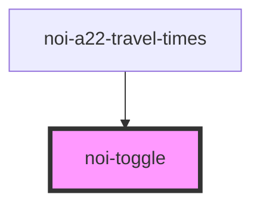

<!--
SPDX-FileCopyrightText: NOI Techpark <digital@noi.bz.it>

SPDX-License-Identifier: CC0-1.0
-->
# noi-toggle

<!-- Auto Generated Below -->

## Overview

(INTERNAL) render a toggle control.

## Properties

| Property  | Attribute | Description   | Type      | Default |
| --------- | --------- | ------------- | --------- | ------- |
| `checked` | `checked` | Checked state | `boolean` | `false` |

## Events

| Event       | Description                                         | Type                                 |
| ----------- | --------------------------------------------------- | ------------------------------------ |
| `noiChange` | Emitted when checked value is changed by user click | `CustomEvent<{ checked: boolean; }>` |

## Methods

### `toggleValue() => Promise<void>`

Toggle checked state

#### Returns

Type: `Promise<void>`

## Shadow Parts

| Part       | Description          |
| ---------- | -------------------- |
| `"handle"` | Handle               |
| `"track"`  | Background container |

## CSS Custom Properties

| Name                         | Description                              |
| ---------------------------- | ---------------------------------------- |
| `--handle-color`             | Handle color                             |
| `--track-background`         | Track background color                   |
| `--track-background-checked` | Track background color when it's checked |

## Dependencies

### Used by

 - [noi-a22-travel-times](../../a22-travel-times)

### Graph

----------------------------------------------

*Built with [StencilJS](https://stenciljs.com/)*
